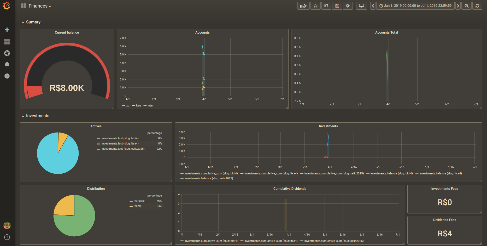

# Grafana Finances

## TODO

- [ ] Filters by investment type
- [ ] Profit percentage by period
- [ ] Profit percentage by investment

## InfluxDB Database

- `wallet` - Global balance
- `investments` - Investments activities
- `dividends` - Dividends activities

### Data examples:

- `INSERT wallet source=itau value=1000 1541930239`

- `INSERT investments slug=selic2025 value=3030,amout=3,fee=322 1541930239`
- `INSERT investments slug=itsa4 value=12.1,amout=12,fee=0 1541930239`

- `INSERT dividends slug=xpml11 value=2.5,fee=0 1541930239`

